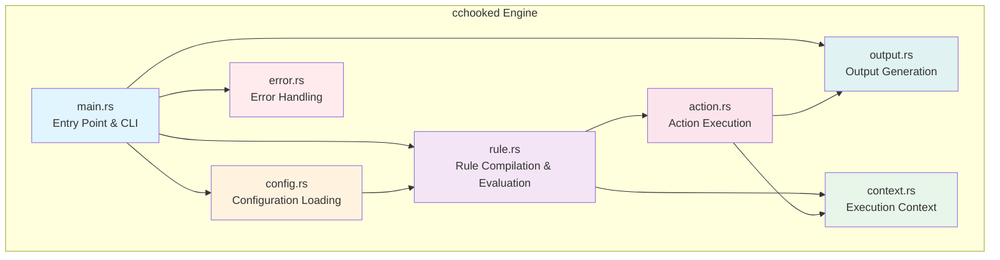
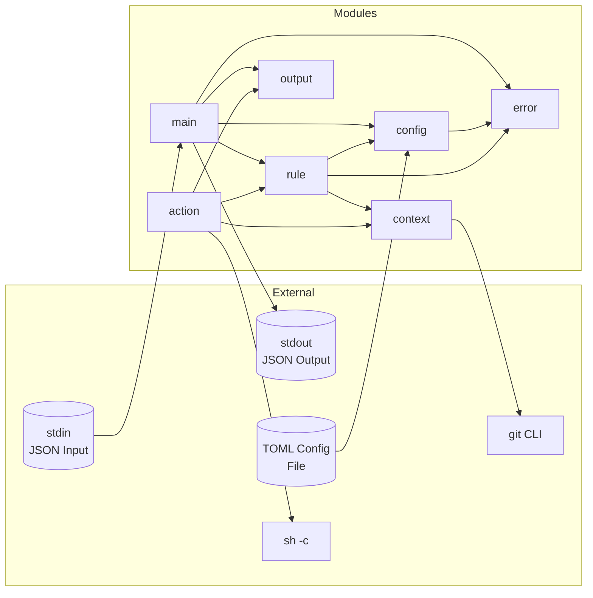
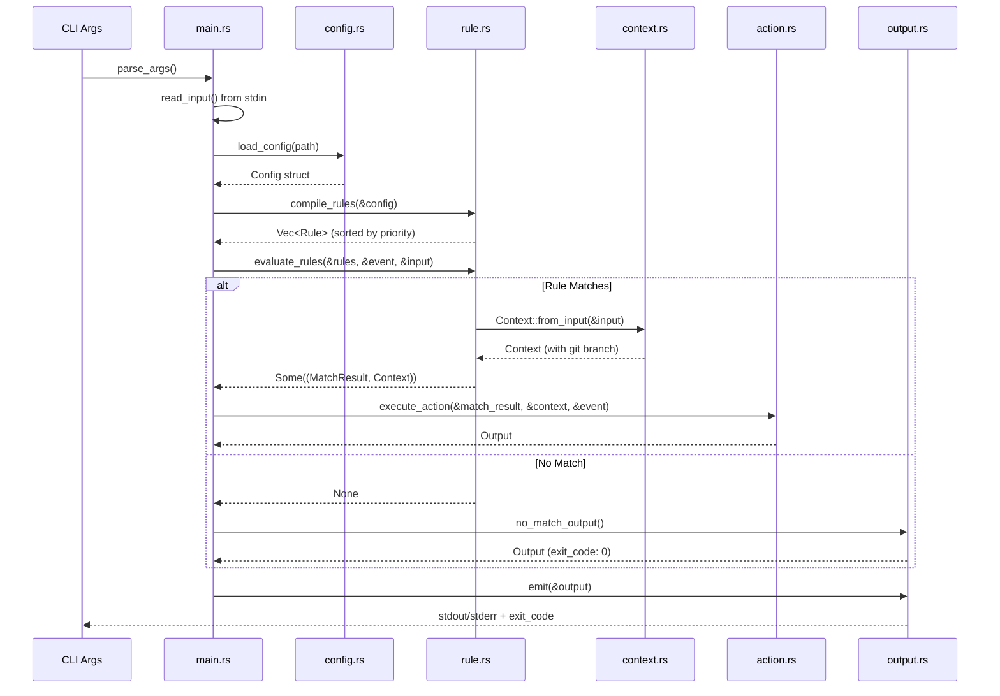
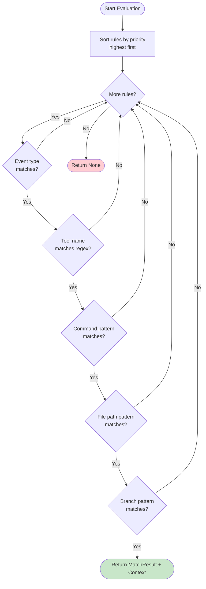
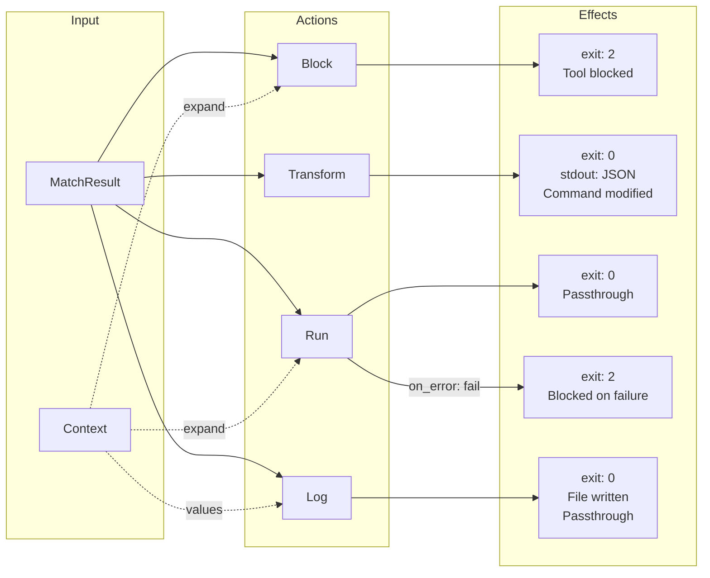
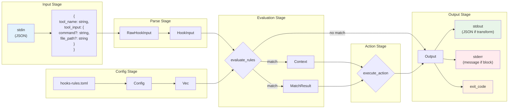
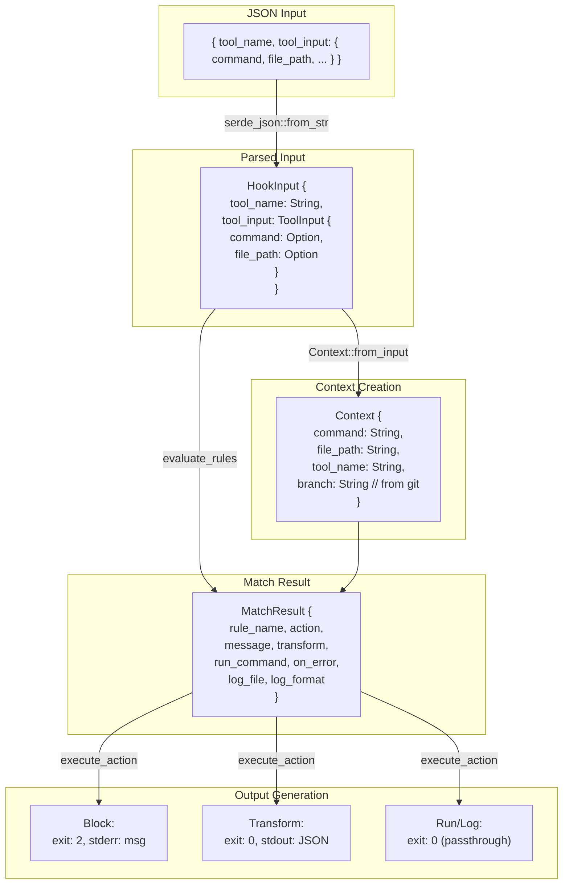

# cchooked Architecture Documentation

## 1. Overview

**cchooked** (Claude Code Hooks Engine) is a rule-based hook processor designed to intercept and control tool invocations in Claude Code. It reads JSON input from stdin describing a tool invocation, evaluates it against a set of configurable rules defined in TOML format, and outputs a decision (allow, block, or transform) as JSON to stdout.

The engine supports:
- **PreToolUse** and **PostToolUse** event hooks
- Pattern matching using regex for tool names, commands, file paths, and git branches
- Four action types: Block, Transform, Run, and Log
- Priority-based rule evaluation (first match wins)
- Template variable expansion for dynamic command generation

## 2. Architecture Diagram



### Module Dependencies



## 3. Processing Flow

### Main Execution Flow



### Rule Evaluation Flow



## 4. Module Structure

| Module | File | Responsibility |
|--------|------|----------------|
| **main** | `src/main.rs` | Entry point, CLI argument parsing, stdin reading, orchestrates the hook processing pipeline |
| **config** | `src/config.rs` | TOML configuration file loading and parsing, defines `Config`, `RuleConfig`, `WhenConfig`, `TransformConfig` structs |
| **rule** | `src/rule.rs` | Rule compilation (regex), rule evaluation, defines `Rule`, `MatchResult`, `EventType`, `ActionType` |
| **context** | `src/context.rs` | Execution context creation, git branch detection, template variable expansion (`${command}`, `${file_path}`, etc.) |
| **action** | `src/action.rs` | Action execution logic for Block, Transform, Run, and Log actions |
| **output** | `src/output.rs` | Output struct definition, JSON serialization for transform output, stdout/stderr emission |
| **error** | `src/error.rs` | Custom error types (`CchookedError`), error formatting, `From` implementations for error conversion |

## Dependencies

| Crate | Purpose |
|-------|---------|
| serde + serde_json | JSON serialization/deserialization |
| toml | TOML configuration parsing |
| regex-lite | Lightweight regex pattern matching |
| chrono | Timestamp generation for logging |

## 5. Key Types

### Core Structs

| Type | Module | Description |
|------|--------|-------------|
| `Config` | config | Root configuration containing all rules as a HashMap |
| `RuleConfig` | config | TOML-deserialized rule configuration with all fields |
| `WhenConfig` | config | Conditional filter configuration (command, file_path, branch patterns) |
| `TransformConfig` | config | Transform action configuration with regex pattern and replacement |
| `StringOrVec` | config | Flexible type accepting single string or array of strings |
| `Rule` | rule | Compiled rule with pre-compiled regex patterns ready for evaluation |
| `MatchResult` | rule | Result of successful rule match containing action details |
| `WhenCondition` | rule | Compiled when conditions with `Vec<Regex>` patterns |
| `TransformRule` | rule | Compiled transform with `Regex` pattern and replacement string |
| `HookInput` | rule | Parsed hook input containing tool_name and tool_input |
| `ToolInput` | rule | Tool parameters (command, file_path) |
| `Context` | context | Runtime context with expanded values and git branch |
| `Output` | output | Final output with exit_code, stdout, and stderr |
| `CchookedError` | error | Comprehensive error enum for all failure cases |

### Enums

| Type | Module | Variants | Description |
|------|--------|----------|-------------|
| `EventType` | rule | `PreToolUse`, `PostToolUse` | Hook event types |
| `ActionType` | rule | `Block`, `Transform`, `Run`, `Log` | Available actions |
| `LogFormat` | rule | `Text`, `Json` | Log output formats |
| `OnErrorBehavior` | rule | `Ignore`, `Fail` | Run action error handling |
| `CchookedError` | error | `ConfigNotFound`, `ConfigParseError`, `InputParseError`, `RegexError`, `InvalidEventType`, `InvalidActionType`, `LogFileMissing`, `IoError` | Error types |

## 6. Action Types

```mermaid
graph TB
    subgraph "Action Types"
        direction TB

        subgraph Block["Block Action"]
            B1[Receive MatchResult]
            B2[Expand message template]
            B3[Return exit_code: 2<br/>stderr: message]
            B1 --> B2 --> B3
        end

        subgraph Transform["Transform Action"]
            T1[Receive MatchResult]
            T2[Apply regex replacement<br/>to command]
            T3[Return JSON with<br/>hookSpecificOutput]
            T1 --> T2 --> T3
        end

        subgraph Run["Run Action"]
            R1[Receive MatchResult]
            R2[Expand command template]
            R3[Execute via sh -c]
            R4{Success?}
            R5[Return exit_code: 0]
            R6{on_error?}
            R7[Ignore: exit_code: 0]
            R8[Fail: exit_code: 2<br/>+ error message]
            R1 --> R2 --> R3 --> R4
            R4 -->|Yes| R5
            R4 -->|No| R6
            R6 -->|ignore| R7
            R6 -->|fail| R8
        end

        subgraph Log["Log Action"]
            L1[Receive MatchResult]
            L2[Format timestamp]
            L3{log_format?}
            L4[Text: timestamp event tool: content]
            L5[JSON: structured object]
            L6[Append to log_file]
            L7[Return exit_code: 0]
            L1 --> L2 --> L3
            L3 -->|text| L4 --> L6
            L3 -->|json| L5 --> L6
            L6 --> L7
        end
    end

    style Block fill:#ffcdd2
    style Transform fill:#c8e6c9
    style Run fill:#fff9c4
    style Log fill:#e1bee7
```



### Action Behavior Summary



### Log Action Features

- `~` in `log_file` path is automatically expanded to `$HOME`
- Parent directories are automatically created if they don't exist
- Logging failures are printed as warnings to stderr and do not block tool execution (exit_code remains 0)

## 7. Data Flow



### Data Transformation Detail



### Exit Code Reference

| Exit Code | Meaning | Scenarios |
|-----------|---------|-----------|
| 0 | Allow / Continue | No rule matched, Transform success, Run success, Log action, Config not found (with warning) |
| 1 | Error | Parse error, invalid arguments, regex compilation error |
| 2 | Block | Block action, Run action with `on_error: fail` |

---

## Quick Reference

### CLI Options

- `<EVENT>` - Required. Event type: `PreToolUse` or `PostToolUse`
- `--config <PATH>` - Path to config file (default: `.claude/hooks-rules.toml`)
- `--help, -h` - Show help message
- `--version, -v` - Show version

### Template Variables

Available in `message`, `command`, and context expansion:

- `${command}` - The command being executed (for Bash tool)
- `${file_path}` - The file path (for file-related tools)
- `${tool_name}` - Name of the tool being invoked
- `${branch}` - Current git branch name

### Configuration Path

Default: `.claude/hooks-rules.toml`

Override with: `--config <path>`

### Configuration Example

```toml
[rules.block-dangerous-commands]
event = "PreToolUse"
matcher = "^Bash$"
action = "block"
message = "Dangerous command blocked: ${command}"
priority = 100

[rules.block-dangerous-commands.when]
command = ["rm\\s+-rf", "git\\s+push\\s+--force"]

[rules.auto-format]
event = "PostToolUse"
matcher = "^(Edit|Write)$"
action = "run"
command = "cargo fmt"
on_error = "ignore"

[rules.auto-format.when]
file_path = "\\.rs$"
```
